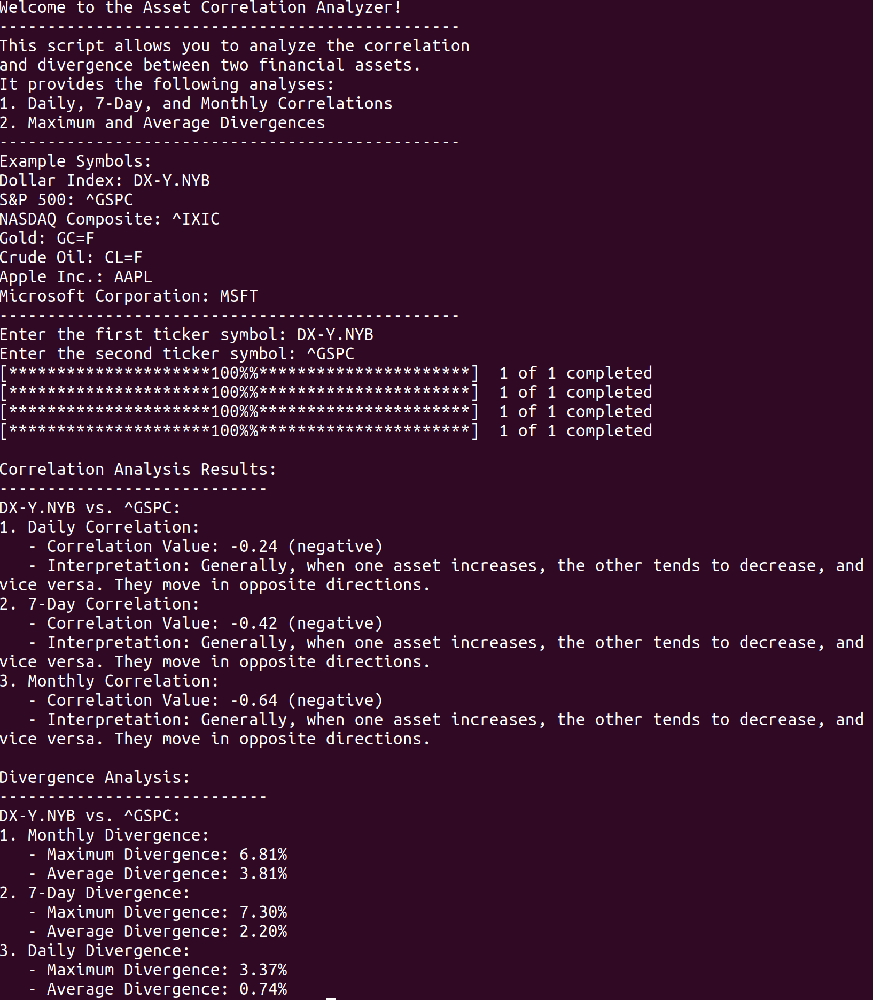
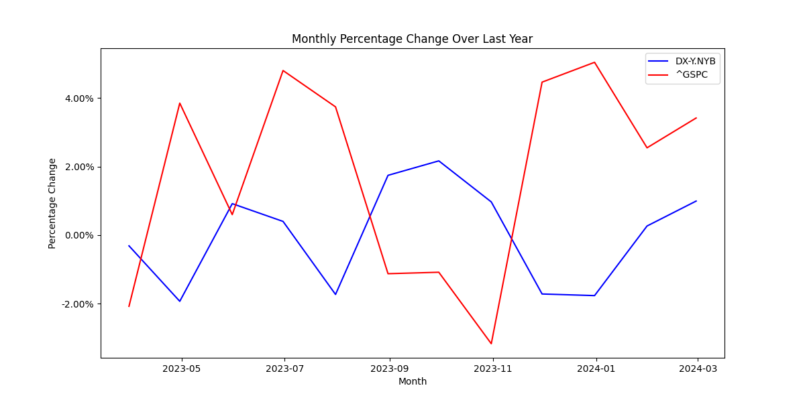
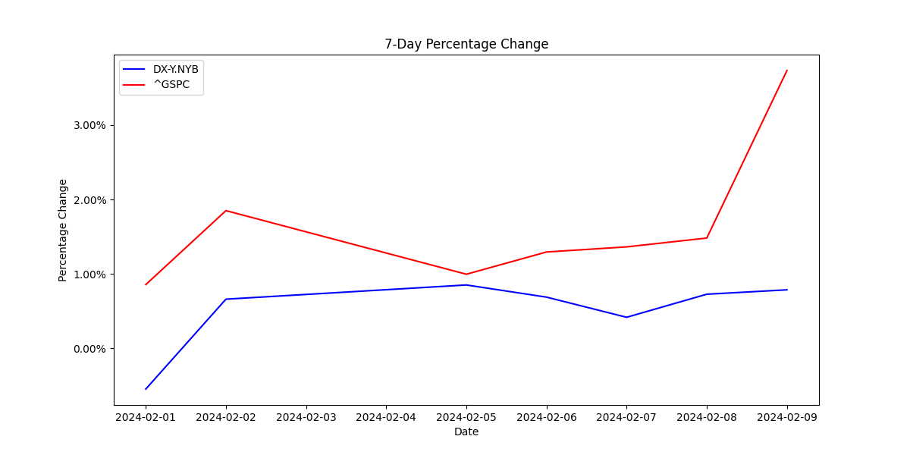

# AssetCorrelation
The Asset Correlation Analyzer is a Python script designed to provide insights into the correlation and divergence between two financial assets.

# Asset Correlation Analyzer

## Purpose
The Asset Correlation Analyzer is a Python script designed to provide insights into the correlation and divergence between two financial assets. 

## Importance of Market Correlations

### Diversification and Risk Management:

Correlations help build diverse portfolios. Low correlations between assets can reduce overall portfolio risk.

### Predicting Trends and Sentiment:

Correlations reveal market trends and sentiments. Recognizing these patterns aids in predicting future price movements.

### Risk-Return Tradeoff:

Assessing correlations assists in balancing risk and return. It helps investors evaluate potential rewards against associated risks.

### Sector Rotation Strategies:

Correlations guide sector rotation, allowing investors to shift assets between sectors based on changing market conditions.

### Global Market Dynamics:

In a global economy, understanding correlations is crucial for navigating international markets and assessing the impact of global events.

### Commodity and Currency Analysis:

Correlations in commodities and currencies are essential for commodity traders and those involved in currency exchange.

### Risk-On/Risk-Off Sentiment:

Investors categorize market environments as "risk-on" or "risk-off" based on correlations, influencing their investment decisions.

In essence, market correlations provide actionable insights for optimizing portfolio performance, managing risk, and making informed investment decisions. They are fundamental tools for investors, traders, and analysts seeking clarity in the interconnected world of financial markets.

## This script performs the following analyses:

1. Daily, 7-Day, and Monthly Correlations.
2. Maximum and Average Divergences.

## Usage

### Requirements

- Python 3.x
- Required Python packages: yfinance, pandas, matplotlib, numpy

### How to Use

1. Clone the repository to your local machine.
2. Install the required Python packages by running: `pip install yfinance pandas matplotlib numpy`.
3. Run the script using: `python marketCorrelation.py`.
4. Follow the on-screen prompts to input the ticker symbols of the assets you want to analyze.
5. The tool will generate correlation analyses, maximum and average divergences, and visualizations for better understanding.

## Example Symbols

- Dollar Index: DX-Y.NYB
- S&P 500: ^GSPC
- NASDAQ Composite: ^IXIC
- Gold: GC=F
- Crude Oil: CL=F
- Apple Inc.: AAPL
- Microsoft Corporation: MSFT

## Analysis Results

### Example of the Program Output

### Graph Output

### Correlation Analysis

- **Daily Correlation:**
  - Correlation Value: [Correlation Value]
  - Interpretation: [Interpretation]

- **7-Day Correlation:**
  - Correlation Value: [Correlation Value]
  - Interpretation: [Interpretation]

- **Monthly Correlation:**
  - Correlation Value: [Correlation Value]
  - Interpretation: [Interpretation]

### Divergence Analysis

- **Monthly Divergence:**
  - Maximum Divergence: [Maximum Divergence]
  - Average Divergence: [Average Divergence]

- **7-Day Divergence:**
  - Maximum Divergence: [Maximum Divergence]
  - Average Divergence: [Average Divergence]

- **Daily Divergence:**
  - Maximum Divergence: [Maximum Divergence]
  - Average Divergence: [Average Divergence]

## Visualizations

### Monthly Percentage Change Over Last Year
Visualizes the monthly percentage change over the last year for two specified assets.

### 7-Day Percentage Change
Displays the 7-day percentage change for two specified assets.

### Intraday Hourly Percentage Change for Last Trading Day
Illustrates the intraday hourly percentage change for the last trading day for two specified assets.

Explore and analyze trends in your preferred financial asset using this powerful Asset Correlation Analyzer.
